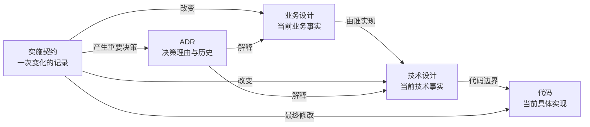

# 建立设计文档体系

只在建立或重构设计型治理体系、地图和基础文档时读取。局部设计修改不要读取本文件。

## 知识模型



- 业务设计权威定义当前有效及已确认待生效的业务含义。
- 技术设计权威定义模块职责、边界和预期实现结构。
- 代码反映当前具体实现；与技术设计冲突时显式处理漂移。
- 实施契约记录变化过程，归档后允许过时。
- ADR 记录为什么决定，不替代当前设计。

## 建立最小结构

根据项目实际调整名称，不机械创建空目录：

```text
docs/
├─ business/
│  ├─ map.md
│  └─ <domain>.md
├─ technical/
│  ├─ map.md
│  └─ modules/<module>.md
├─ decisions/
└─ implementation/
   ├─ active/
   └─ archive/
```

该骨架只是建议，不是实际路径的权威定义。先识别现有入口和知识归属，再建立缺失的最小文档。

业务地图维护领域关系与配合；技术地图维护整体模块关系和业务—技术映射。地图只做导航和概览，不复制详细规则。根 `AGENTS.md` 只维护稳定入口，不复制完整拓扑。

## 划分文档

只有内容具有内聚职责、稳定边界、独立变化原因或独立验证条件时才拆成独立文档。如果内容总是一起理解、一起变化，保留在同一文档。

业务领域最小结构：

```markdown
# 领域名称

## 范围
## 业务设计
## 领域关系
## 文档关系
### 上游文档
### 下游文档
```

技术模块最小结构：

```markdown
# 模块名称

## 职责与边界
## 业务映射
## 模块关系
## 代码位置
- 根目录：
- 关键入口：
- 测试位置：
## 文档关系
### 上游文档
### 下游文档
```

空的可选章节直接省略。技术模块只维护稳定代码锚点，不枚举普通内部文件。

## 建立关系

- 每份领域和模块文档维护双方一致的文件级上下游。
- 细节依赖使用文档路径和标题锚点，只在依赖方单向记录。
- 技术模块链接其实现的业务领域或能力。
- 同一事实只允许一个权威来源；需要复述时标为非权威摘要并链接来源。
- 不分配独立文档 ID；移动或重命名时更新路径引用。

## 完成条件

- 实际业务地图、技术地图、ADR 和实施契约入口可被发现。
- 业务、技术、实施过程和决策历史的权威职责互不重叠。
- 地图能够定位领域、模块及其映射，但没有复制详细规则。
- 文档关系和代码锚点足以支持后续局部读取。
- 没有空目录、虚假入口或按推荐骨架猜测出的路径。

需要写入或更新常驻声明时，返回 `SKILL.md` 叠加“常驻治理声明”任务包。
