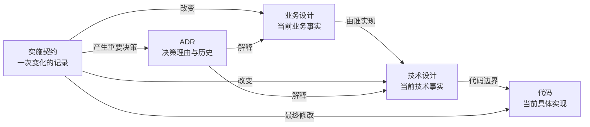

# 文档治理模型与模板

## 目录

- [整体模型](#整体模型)
- [目录骨架](#目录骨架)
- [权威与重复](#权威与重复)
- [拆分规则](#拆分规则)
- [关系规则](#关系规则)
- [业务领域模板](#业务领域模板)
- [技术模块模板](#技术模块模板)
- [代码映射](#代码映射)
- [ADR](#adr)
- [可视化](#可视化)

## 整体模型



- 业务设计权威定义当前业务含义。
- 技术设计权威定义模块职责、边界和预期实现结构。
- 代码权威反映当前具体实现。代码与技术设计冲突时属于设计—实现漂移，需要显式处理。
- 实施契约记录变化过程，归档后允许过时。
- ADR 记录为什么决定，不替代当前设计；失效时由新 ADR 取代旧 ADR。

## 目录骨架

根据项目实际调整名称，不机械创建空目录：

```text
docs/
├─ business/
│  ├─ map.md
│  └─ <domain>.md
├─ technical/
│  ├─ map.md
│  └─ modules/
│     └─ <module>.md
├─ decisions/
│  └─ ADR-<number>-<title>.md
└─ implementation/
   ├─ active/
   └─ archive/
```

业务地图说明领域关系和配合；技术地图说明整体架构、模块关系及业务—技术映射。地图只做导航和概览，不复制详细规则。

## 权威与重复

| 内容形态 | 规则 |
| --- | --- |
| 多处独立定义同一事实 | 禁止；合并到一个权威来源 |
| 为上下文复述事实 | 允许；标记非权威摘要并链接来源 |
| 业务规则的技术实现 | 允许；技术文档声明实现哪个业务设计 |
| 归档契约记录旧设计 | 允许；明确为历史，不据此判断现状 |

非权威摘要统一写成：

```markdown
> **非权威摘要**
>
> 本段仅为当前上下文提供说明。权威定义见：[目标文档](path#heading)。
```

普通链接没有复述事实时不需要标记。摘要不得引入来源中不存在的新含义。

## 拆分规则

每条主线采用自己的最小模板，不使用万能模板。空的可选章节直接省略。

满足以下任一信号时考虑拆分：

- 内容拥有独立语义或职责；
- 内容有独立变化原因；
- 内容经常被单独引用；
- 内容能够独立理解和验收。

如果内容总是一起理解、一起变化，拆分只会增加跳转，则保留在同一文档。不要按字数、章节数量、代码文件数量或“看起来稳定”机械拆分。

## 关系规则

### 文件级关系

每份领域和模块文档维护双方一致的上下游：

```markdown
## 文档关系

### 上游文档

- [上游名称](../path.md)

### 下游文档

- [下游名称](../path.md)
```

文件级关系是有意保留的导航冗余。修改关系时同步更新两端。

### 细节级关系

在依赖方单向记录，不维护反向副本：

```markdown
## 关系

| 关系 | 目标 |
| --- | --- |
| 依赖 | [支付规则](../business/payment.md#支付完成) |
| 实现 | [退款能力](../business/refund.md#退款资格) |
```

使用文档路径和标题锚点，不分配独立 ID。移动或重命名文档时同步更新所有引用。

## 业务领域模板

```markdown
# 领域名称

## 范围

说明负责什么、不负责什么。

## 业务设计

按需要描述概念、规则和流程。

## 领域关系

说明依赖、协作，以及跨领域事实由谁权威定义。

## 文档关系

### 上游文档

### 下游文档
```

业务领域是拥有相对独立业务职责的范围，不等同于每一个代码实体。

## 技术模块模板

```markdown
# 模块名称

## 职责与边界

说明负责什么、不负责什么。

## 业务映射

链接本模块实现的业务领域或业务能力。

## 模块关系

说明依赖、对外能力和主要交互。

## 代码位置

- 根目录：
- 关键入口：
- 测试位置：

## 文档关系

### 上游文档

### 下游文档
```

技术文档描述值得长期维护的事实，不枚举可以直接从代码准确获得的普通内部细节。

## 代码映射

每个技术模块只维护稳定锚点：

- 模块代码根目录；
- 关键入口；
- 测试位置。

不要维护完整文件清单。Agent 从锚点开始搜索，只有发现明确导入、调用或数据依赖时才扩大代码范围。

共享库和横切组件应作为技术模块或明确依赖处理，不得成为默认扫描整个仓库的理由。实际代码越过声明边界时，报告映射漂移并判断应修正文档、代码还是两者。

## ADR

以下情况创建 ADR：

- 改变长期业务或技术边界；
- 影响多个领域或模块；
- 存在多个合理方案和重要取舍；
- 决策难以撤销或撤销成本高；
- 决策会约束后续设计。

普通、容易撤销的实现细节不创建 ADR。

最小模板：

```markdown
# ADR：决策名称

## 状态

提议 / 接受 / 已取代

## 背景

说明需要决定的问题和约束。

## 决策

说明选择及关键理由。

## 考虑过的方案

列出真正参与取舍的方案。

## 后果

说明收益、代价和长期约束。

## 影响范围

链接受影响的业务设计、技术设计和实施契约。

## 取代关系

需要时链接被取代或取代本记录的 ADR。
```

ADR 被取代时保留原文，创建新 ADR 并建立取代关系。当前业务或技术事实必须同步更新，不能只存在于 ADR。

## 可视化

当内容涉及三个及以上对象之间的关系、协作、依赖、流转或层级，或者涉及分支、循环、阶段、状态变化时，先用图表达整体关系。

| 内容 | 表达方式 |
| --- | --- |
| 静态对象、模块或文档关系 | Mermaid 关系图 |
| 操作步骤、判断和分支 | Mermaid 流程图 |
| 多对象按时间交互 | Mermaid 时序图 |
| 状态与状态转换 | Mermaid 状态图 |
| 上下级和包含关系 | Mermaid 层级图 |
| 简单字段或职责对应 | 表格 |

图必须能够独立看懂，使用明确节点名称。图表达主关系，正文定义详细规则；冲突时修正图，不将图变成另一个权威来源。
