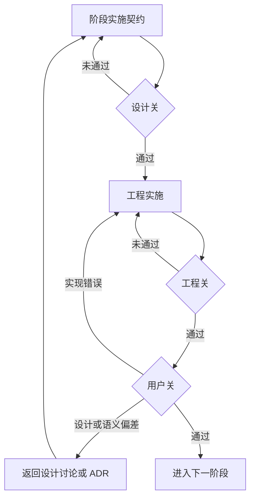

# 完整实施治理规范

仅在用户已经选择完整治理后读取和使用本文件。

## 目录

- [治理目标](#治理目标)
- [总体原则](#总体原则)
- [实施计划](#实施计划)
- [阶段实施契约](#阶段实施契约)
- [三道验收关](#三道验收关)
- [验证粒度](#验证粒度)
- [偏差处理](#偏差处理)
- [完成门槛](#完成门槛)

## 治理目标

持续校验以下三者的一致性：

- **设计意图**：产品要解决的问题、业务规则和边界。
- **实现语义**：代码对象、状态、流程和约束实际表达的含义。
- **用户认知**：用户看到的信息、执行的操作和得到的结果是否符合真实场景。

按可验证的用户结果纵向分阶段，不按数据库、后端、前端等技术层横向分阶段。发现语义偏差后立即停止扩展，回到正确层级澄清并纠正。

## 总体原则

- 每阶段只交付一个主要用户结果，并能独立运行和验收。
- 只补齐当前阶段依赖的设计，不提前展开后续字段、流程和界面。
- 明确非目标，禁止顺手扩展相邻能力。
- 编码前通过设计关，工程验证后通过用户关。
- 自动化测试验证实现稳定性，用户验收验证产品语义，二者不能替代。
- 前一阶段未通过用户关，不进入下一阶段。
- Agent 不自行填补会改变业务语义的设计缺口。
- 涉及旧数据时，先确认真实数据及其保留价值，再由用户选择迁移、清空重建或新旧并存。未经确认，数据迁移属于停止条件。

## 实施计划

实施计划至少包含：

| 章节 | 必须回答的问题 |
| --- | --- |
| 目标与范围 | 解决什么问题，为什么需要分阶段 |
| 实施原则 | 如何控制范围、验证结果和处理未知设计 |
| 阶段路线 | 阶段顺序、依赖关系和当前位置 |
| 阶段总表 | 每阶段的唯一用户结果、验证重点和完成门槛 |
| 各阶段边界 | 每阶段做什么、不做什么、进入前需确认什么 |
| 阶段实施契约要求 | 每阶段开始前需要哪些可执行输入 |
| 验收机制 | 设计关、工程关和用户关分别验证什么 |
| 偏差处理 | 不同偏差在哪个层级纠正 |
| 当前实施位置 | 已完成内容、证据和下一步约束 |

涉及三个以上阶段或存在阶段依赖关系时，用 Mermaid 图表达整体路线。

## 阶段实施契约

每阶段开始前形成一份可独立执行的契约，至少包含：

| 项目 | 要求 |
| --- | --- |
| 唯一用户结果 | 用一句话描述完成后用户能够做什么 |
| 用户场景 | 说明真实场景、用户目标和正确性判断依据 |
| 设计依据 | 只引用本阶段依赖的已确认设计、ADR 和前置契约 |
| 实现语义映射 | 对应产品概念与代码对象、状态、入口和数据变化 |
| 范围 | 列出必须实现的能力 |
| 非目标 | 列出明确不实现的相邻能力 |
| 固定验收数据 | 开发、自动测试和人工验收使用同一组可复现数据 |
| 人工验收场景 | 包含前置条件、操作步骤、预期结果和语义判断 |
| 自动化验证 | 区分迭代验证与收口验证，说明扩大条件 |
| 交付证据 | 提供运行方式、测试结果、界面证据、变更清单和限制 |
| 数据处理 | 记录真实旧数据保留需求和用户确认的处理策略 |
| 停止条件 | 明确必须暂停的设计缺口、语义冲突或范围冲突 |
| 验收结论 | 分别记录设计关、工程关和用户关结论 |

“实现语义映射”必须足以在编码前发现：

- 同一个词在产品设计和代码中是否表达不同对象。
- 状态或规则是否落在错误的数据粒度。
- 用户操作入口是否混合不同业务语义。
- 数据变化、历史留痕和界面反馈是否表达同一件事。
- 技术约束是否被误写成产品规则，或产品规则是否只存在于界面层。

## 三道验收关

### 设计关

- 唯一用户结果、真实场景和依赖的业务规则明确。
- 产品概念到实现对象的语义映射清晰。
- 范围、非目标、验收步骤和停止条件明确。
- Agent 无需猜测业务语义即可实施。

### 工程关

- 收口验证覆盖当前最终版本并通过。
- 关键数据约束和异常路径得到验证。
- 实现符合契约中的语义映射且没有超出范围。
- 运行方式和交付证据可复现。

### 用户关

请用户判断信息表达、操作过程和结果是否符合真实认知与业务含义。技术上正确但产品语义错误时，不得通过。

## 验证粒度

### 迭代验证

每次修改只运行覆盖当前影响范围的最小充分检查：

| 改动类型 | 默认最小验证 |
| --- | --- |
| 文档、注释、静态说明 | 差异检查；必要时检查链接、术语和格式 |
| 局部文案、布局、样式 | 类型检查或构建；有交互时运行页面单项测试；布局变化时检查截图 |
| 局部领域规则或纯函数 | 受影响模块单元测试；类型检查或构建 |
| 局部服务或用户流程 | 模块测试、成功与失败路径、相关页面单项回归、构建 |
| 共享组件、公共接口 | 已知调用方相关测试、构建；必要时跨模块回归 |
| 存储、迁移、事务、权限、安全、依赖或构建配置 | 专项测试，并按风险扩大到完整单元、集成或页面回归 |

出现共享影响、数据或安全变化、跨领域累计修改、影响无法界定、相邻回归、准备合并发布或用户要求时，扩大验证范围。

### 收口验证

- 相关实现和用户反馈稳定后，对最终版本集中执行契约规定的完整检查。
- 最终版本再次发生代码变化后，原工程关结论失效。
- 工程关后的局部修正先定向验证，反馈稳定后统一重跑收口验证。
- 记录实际命令、覆盖范围和未运行项；不得把定向验证称为完整工程关通过。
- 修复失败项后先重跑失败项，只有影响扩大时才扩大测试。
- 只保留当前变更需要的截图、快照和构建证据。

## 偏差处理

| 偏差类型 | 处理动作 |
| --- | --- |
| 实现不符合已确认设计 | 留在当前阶段修复并重新通过工程关 |
| 交互表达不符合用户认知 | 调整当前阶段，不扩展功能范围 |
| 产品概念与代码对象不一致 | 暂停实施，修正设计、语义映射和必要 ADR |
| 设计存在缺口或歧义 | 暂停并确认规则，不由 Agent 猜测 |
| 出现新需求 | 记录到后续阶段，不顺手加入当前阶段 |
| 核心对象、状态粒度或原子边界错误 | 暂停后续阶段，评估影响并插入纠偏阶段 |

## 完成门槛

缺少以下任一项，阶段不得标记为可执行：

- 唯一用户结果。
- 明确的范围与非目标。
- 已确认的设计依据。
- 产品概念到实现对象的语义映射。
- 可重复执行的人工验收场景。
- 可验证的自动化要求。
- 涉及旧数据时，已确认的数据保留需求和处理策略。
- 明确的停止条件。

缺少用户关结论，阶段不得标记为已完成。
